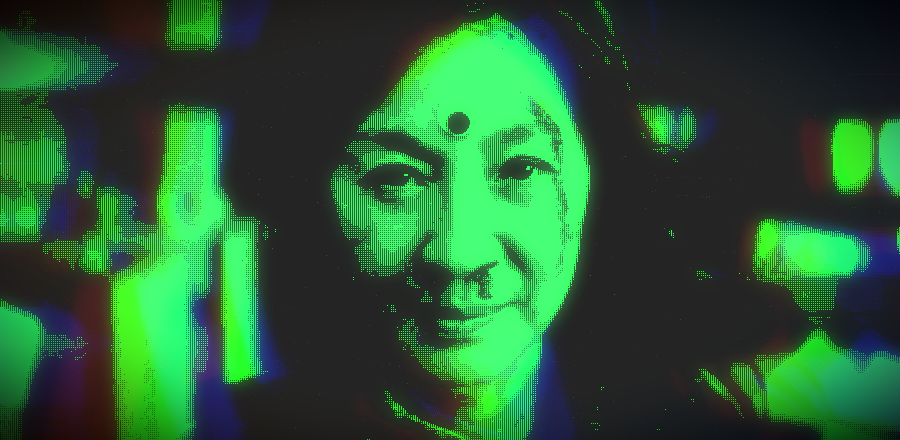

# "Retro Dither" post-processing effect

A retro looking "pattern based dithering" GLSL post-processing effect based on [Texturelabs Analog Retro-Futuristic Monitor in Photoshop tutorial](https://texturelabs.org/tutorials/analog-retro-futuristic-monitor-in-photoshop/).
